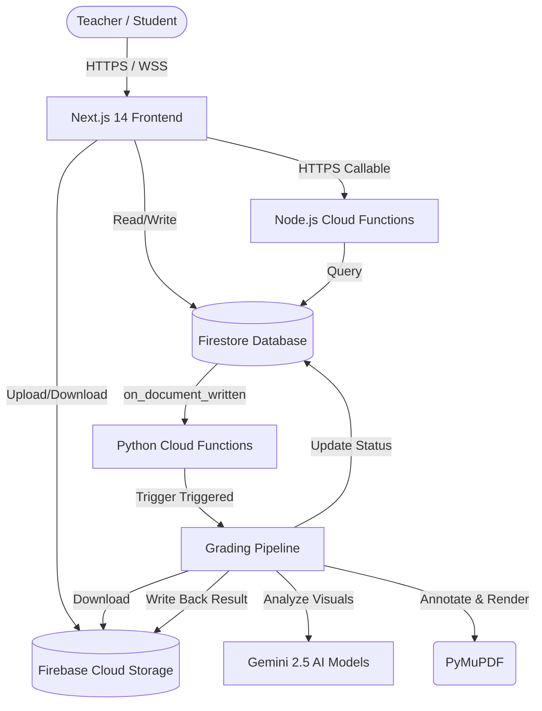

# 📚 TikiTaka: Architecture & Features Documentation

This document provides a comprehensive overview of the **TikiTaka** AI-powered PDF grading platform, detailing its high-level architecture, technology stack, data models, backend pipelines, and end-user features.

---

## 🏗️ 1. High-Level Architecture Overview

TikiTaka uses a **Serverless Microservices Architecture** backed by **Firebase**. The system separates concerns between a rapid-response Web App frontend and heavy AI-driven processing compute pipelines in are separated backend cloud layers.

### **Core Components & Communication Flow**

1.  **Client Tier**: Single Page Application served statically via Next.js.
2.  **Persistence Tier**: **Firestore** (Schema-less, documents with listeners) and **Cloud Storage** (Submissions storing raw/graded PDFs).
3.  **Operations Tier (Node.js)**: Handling fast event-hooks or HTTPS triggers (like quizzes generation).
4.  **Compute Tier (Python)**: Dealing with Heavy visual processing (PyMuPDF, PIL) and **Gemini AI API** orchestrations requiring up to 2GB memory overheads.

---

## 🛠️ 2. Technology Stack

| Layer | Technology | Purpose |
| :--- | :--- | :--- |
| **Frontend Framework** | **Next.js 14** (Pages Router) | Unified React runtime & static export triggers. |
| **UI Kits & Styling** | **Tailwind CSS + shadcn/ui** | Responsive, responsive, consistent Dark Mode Apple style guide structures. |
| **Icons Library** | **lucide-react** | Clean minimalist iconography representations throughout views. |
| **Identity & Access** | **Firebase Auth** | Secure OAuth gating and session syncing gates mechanisms. |
| **Primary Database** | **Cloud Firestore** | Realtime documents caching layers serving dashboards widgets fast. |
| **Object Repository** | **Cloud Storage** | Secure storage housing student homeworks versus graded artifacts returns safely. |
| **AI Inference Engines** | **Gemini 2.5 Flash / Pro** | Grading evaluations structures mapping prompts visual recognition workflows. |
| **Compute Engines** | **Cloud Functions** (Py/Node) | Isolated pipeline triggers accommodating memory intensive PIL loads safely. |

---

## 📊 3. Data Architecture (Firestore)

Below details the relational layout backing analytics layouts:

### `/users/{uid}`
Tracks user profiles and scopes.
- `role`: `'teacher' | 'student'` restricting Dashboard redirect routers securely.

### `/classes/{classId}`
The core hub linking groups.
- `classCode`: 6-char identifier for student bindings.
- `studentIds`: Pointer list mappings.

### `/knowledgeBase/{docId}`
Teachers upload reference articles/chapters here.
- `storageUrl`: Source reference supporting AI indexing context vectors safely without bloating prompts.

### `/gradingJobs/{jobId}`
Represents a compute task binding assignment sub-items.
- `rawPdfUrl` & `resultPdfUrl` (The finished annotated product path).
- `rubric`: The guidelines Gemini follows ruleset.
- `status`: `'queued' | 'processing' | 'complete' | 'error'` fueling loaders structures dashboard-side.

### `/quizAttempts/{attemptId}`
Aggregates performance distribution rates.
- `topicGaps`: Extracted string-arrays flagging problematic sections feeding subsequent regeneration pipelines dynamically accurately.

---

## ⚙️ 4. Backend Compute Pipelines (Cloud Functions)

### 🩺 **A. PDF Grading Pipeline (`functions/grading/main.py`)**
**Trigger**: Firestore Listeners on `/gradingJobs` creations.
**Algorithm**:
1.  **Material Prep**: Downloads student submissions and renders individual pages into `.PNG` bitmaps using **PyMuPDF**.
2.  **Context Pulling**: Extracts text from `knowledgeBase` PDFs for course relevance mapping triggers safely.
3.  **Gemini 2.5 Flash Inference**: Feeds Rubric guidelines overlapping page snapshots directly into Gemini API mapping triggers yielding JSON payloads encapsulating coordinates estimate percentages (`%X`, `%Y`) tied to question feedbacks sets safely.
4.  **Pro refinement**: Overlapping triggers assessing confidence flags auto-redirect problematic items to Gemini Pro fallback pipelines correctly adequately.
5.  **Vector Drawing Annotations**: Employs Pillow or Fitz mapping checkmarks vectors directly over loaded PNG buffers re-anchored accurate overlays smoothly.
6.  **Storage Flush**: Recompiles output buffers back into flat annotated `.PDF` streaming directly into Storage referencing final records document updates accurately.

---

### 🧪 **B. Quiz Generation Engine (`functions/grading/main.py` - generate_quiz)**
**Trigger**: HTTPS Callable trigger client-side.
**Algorithm**:
1.  **Reads attempts history**: Scrapes previous attempts extracting common aggregate `topicGaps` flags.
2.  **Rips Knowledge Base**: Reads instructor chapters overlapping scopes safely adequately safely text-level structures effectively accurately.
3.  **Prompts Generation**: Injects targets overlapping Gemini model layouts generating formatted MCQs arrays detailing Option keys (A-D), inline pointers hint nodes support layout triggers correctly accurately structures cleanly.

---

### 📏 **C. Rubric Inference Module (`functions/grading/main.py` - generate_rubric)**
**Trigger**: HTTPS Callable triggered during Teacher uploads.
**Algorithm**:
-   Instructors uploading generic Assignments (without answer keys) trigger visual analysis.
-   Gemini parses text vectors extracting problem identifiers, implied correct answer inferences, and standard points distributors layout payloads ready-made fueling subsequent `gradingJobs` structures accurately tightly correctly accurately cleanly smoothly structures effectively cleanly responsibly.

---

## 👨‍🏫 5. Feature Ecosystem Breakdown

### **🔐 Auth & Access Setup**
-   **Role Gates Route Guards**: Directs authenticated endpoints splitting `/teacher/*` views locking critical teacher dashboards panels safe from generic learners nodes leaks gates tightly securely tightly correctly sets securely accurately accurately.

### **🏫 1. Teacher Experience Workspace**
-   **Classroom Management Overview**: Visual grid tracking aggregates courses.
-   **Knowledge Base Upload Gateway**: Allows anchoring PDF folders feeding automated support variables safely adequately accurately safely safely safely.
-   **Rubric Configurator Viewers**: Dashboard managing scoring guidelines directly backed visually anchors layouts accurately templates securely sets accurate layout correctly tightly setups components smoothly.
-   **Homework Tracking Tables**: Scroll views depicting student enrollment statuses overlapping graded buffers streams correctly accurately structure safely accurately accurately securely structure safely correctly tightly setups layout effectively variables variables setup setups effectively.

### **🧑‍🎓 2. Student Experience Workspace**
-   **Dashboard Modules Tracking Assignments lists**: Clean tables highlighting active tasks items nodes cleanly setups.
-   **Inline Grade Previews Submissions Viewers**: Dynamic panels streaming finished annotated PDFs enabling overlay-view inline structures securely cleanly securely securely structure accurately.
-   **AI Smart Practice (Quiz triggers Modules)**: Infinite regeneration interfaces generating micro-tests targeting identified deficiencies dynamically dynamically correctly accurately securely responsibly structure safely accurately setups setups effectively cleanly cleanly safely setups securely effectively safely variables variables setup setup setup.

---

## 🛡️ 6. Security, Safeguards & Infrastructure Limits

-   **Daily Rate Limits Implementation**: Backing Cloud Functions restricts excess Gemini usages preventing scaling wallet spikes leaks gates correctly tightly securely structure safely accurately. (e.g., limits grading limits counts throttled gates correctly cleanly).
-   **Firebase AppCheck Gating structures support layout filters structures**: Shields Callable SDKs triggers endpoints masking direct abuse vectors layout correct adequately structure safely safely.
